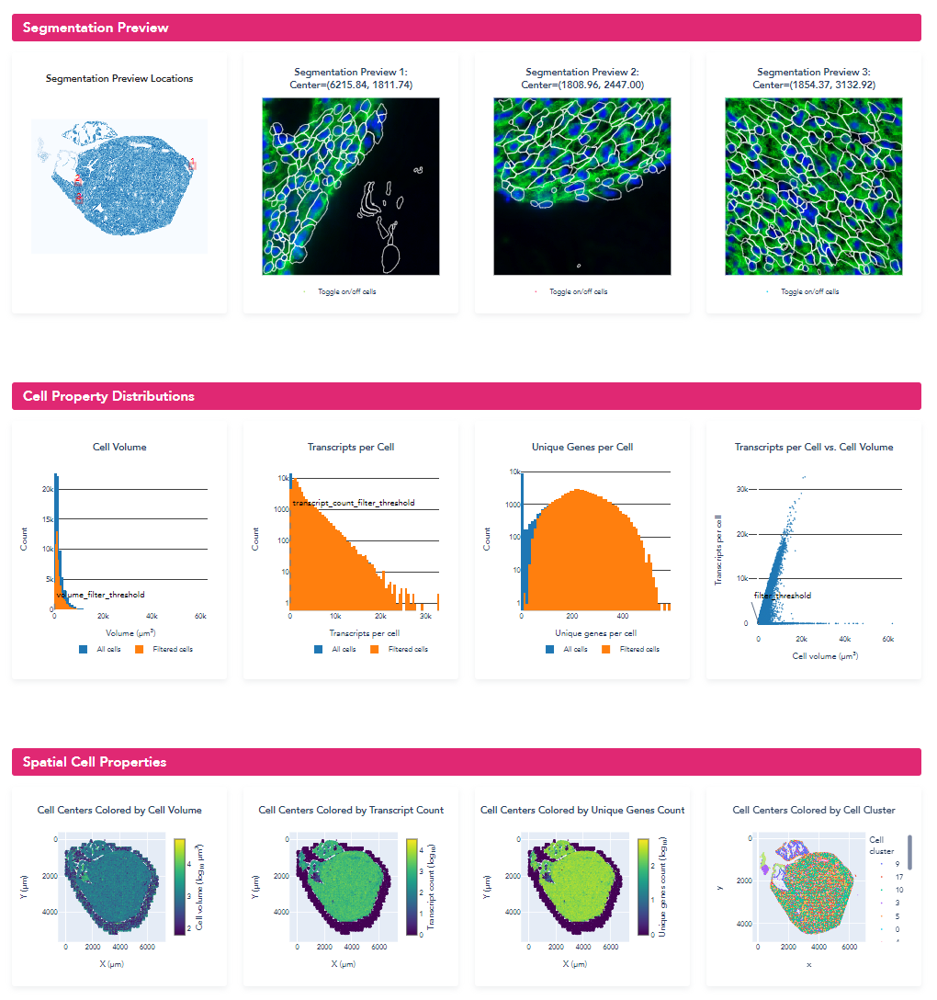
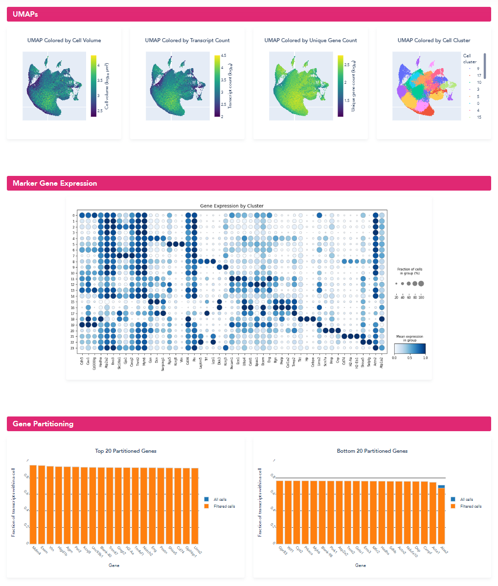

Example: Re-segmenting a MERSCOPE Heart Dataset with a Machine Learning Model Customized with Manual Annotations
================================================================================================================

Introduction
""""""""""""""""""""""""""""""""""""""""""""""""
MERSCOPE maps the precise locations of hundreds of millions of transcripts from hundreds of genes across intact tissue slices 
using MERFISH technology.  The high-resolution, highly multiplexed measurements enable mapping the cellular composition of 
tissues with fine cell-type resolution. This single-cell analysis is greatly facilitated by MERSCOPEs cell boundary stain 
and onboard cell segmentation algorithms that provide single-cell analysis results alongside the list of detected transcripts.  
However, cells in some tissues, such as multinucleated muscle tissues or tissues with abnormal cell shape may not be segmented 
well by the MERSCOPE onboard cell segmentation algorithms. For these tissues that are more challenging to segment, you can 
improve the segmentation results by hand annotating a small number of tiles, following the steps described in this workflow. 

The workflow includes several steps – the first part consists of evaluating the initial segmentation to determine the need 
to improve the segmentation results. Next, identifying problematic regions using MERSCOPE Vizualizer and extracting corresponding 
image patches with the Vizgen Postprocessing Tool (VPT). Then, loading the image patches into Cellpose 2 (Pachitariu & Stringer, Nature Methods, 2022) 
and annotating the boundaries of the observed cells to retrain the Cellpose2 model. Lastly, using VPT to resegment the full 
dataset and evaluate the improved segmentation results.  Here we show how the workflow can be applied to heart tissue to 
generate improved segmentation where the resegmented cells better visually match the cell boundary stain, have a much larger 
volume consistent with the larger volume of heart cells, and a substantially larger fraction of transcripts are assigned 
to a cell compared to the original cell segmentation results. The heart dataset used has an imaged area of 27.5 square millimeters 
and 205,596,450 transcripts.

.. image::  ../_static/vignette_images/cellpose2/cellpose2_workflow.png
    :width: 1200
    :align: center
    :alt: An image of cellpose2 workflow

|

**Workflow inputs**

This workflow processes the output data from the MERSCOPE instrument. For a dataset named %EXPERIMENT_NAME%, the output 
data is found on the MERSCOPE instrument under z:\\merfish_output\\%EXPERIMENT_NAME%\\%REGION_NAME%\\. Within this directory, 
you can find the following files that are required as inputs for this workflow.

.. list-table::
   :widths: 50 50 120
   :header-rows: 1

   * - Input 
     - File Name  
     - Description
   * - Mosaic tiff images
     - images/mosaic_{stain name}_z{z level}.tif 
     - | Every image channel acquired during a MERFISH experiment that is not decoded as a MERFISH 
       | bit, will be output as a mosaic tiff image in this folder. This includes DAPI, PolyT, Cellbound 
       | stains (if applicable), and subsequent round stains (if applicable). The raw data images from 
       | the MERFISH experiment are stitched together based on the alignment of fiducial beads to create 
       | a mosaic that minimizes the appearance of seams between fields of view. The images themselves 
       | are single channel, single plane, 16-bit grayscale tiff files, with the naming convention 
       | ``mosaic_{stain name}_z{z level}.tif``
   * - Micron to mosaic pixel transformation matrix
     - micron_to_mosaic_pixel_transform.csv
     - | An affine transformation matrix describing translation and a scaling to convert from  micron 
       | units (used for transcirpt locations) to pixel units (of the mosaic images). This file helps convert 
       | the coordinates of the pixels in the mosaic tiff images to real world micron coordinates.
   * - List of detected transcripts
     - detected_transcripts.csv
     - | The ``detected_transcripts.csv`` file is a standard comma separated values (csv) formatted 
       | text file that lists all of the transcripts detected in the MERSCOPE run, include the gene identity 
       | of each transcripts and it’s x, y, and z location within the sample. 
   * - VZG file
     - {experiment_name}_region_{region_index}.vzg
     - | The VZG file contains a representation of the dataset that can be opened with the 
       | MERSCOPE Vizualizer. It contains all the information needed to interactively visualize 
       | the transcript locations, cell boundaries, and a compressed version of the mosaic image 
       | channels (e.g. DAPI, PolyT, Cellbound stains).

**Workflow Summary (6 hours 30 minutes)**

.. note::
    We ran the VPT re-segmentation on a more powerful computer than we used for the rest of the workflow. We utilized a 
    compute instance with 32 cores and 256GB of RAM. The rest of the steps were completed on a machine with 4 cores and 
    16GB of RAM.

.. list-table::
   :widths: 50 120 50
   :header-rows: 1

   * - Step 
     - Summary 
     - Time Estimate (for heart dataset)
   * - System setup
     - | Identify the location of the required input files. Install MERSCOPE Vizualizer, Vizgen 
       | Postprocessing Tool (VPT), and Cellpose 2.
     - 15 minutes
   * - Evaluate baseline segmentation
     - | Load the VZG file for the dataset into the MERSCOPE Vizualizer and evaluate the initial 
       | segmentation results.
     - 15 minutes
   * - | Identify regions to target for segmentation model retraining 
       | and extract image patches
     - | Identify regions that need improved segmentation using MERSCOPE Vizualizer. Extract 
       | corresponding image patches from the mosaic tiff images using VPT. For this example we 
       | extracted 20 patches, each 108 x 108 um.
     - 30 minutes
   * - Annotate cell boundaries on extracted image patches
     - | Load the extracted patches into the Cellpose UI and use the Cellpose tools to annotate the 
       | boundaries on each image.
     - 3 hours, 30 minutes
   * - Retrain the machine learning model using the annotations
     - | Use the Cellpose UI to retrain the base model using the manual annotations. Here we 
       | retrained with 100 epochs.
     - 30 minutes
   * - | Re-segment the full MERSCOPE dataset using the 
       | retrained model
     - | Use VPT to re-segment the full dataset, generating a new VZG file, cell metadata, and 
       | cell by gene matrix with the new segmentation results. 
     - 1 hour
   * - Evaluate the new segmentation
     - | Load the new VZG file into MERSCOPE Vizualizer to qualitatively examine the new 
       | segmentation and use VPT to generate a quantitative segmentation report.
     - 30 minutes

System Setup
""""""""""""""""""""""""""""""""""""""""""""""""
**Requirements Summary**

* Computer:

    * Windows or MacOS (at least Yosemite) (Windows 10 used here with VPT running in WSL)
    * > 16 GB RAM recommended (16GB used here)
    * i7-1185G used here 

* Software:

    * MERSCOPE Vizualizer
    * Python >=3.9 and <3.11 with virtual environments configured for:

        * ``vpt >= 1.2.0``
        * ``cellpose >= 2.0.0``

**MERSCOPE Vizualizer**

The MERSCOPE Vizualizer is a software tool for interactively exploring MERSCOPE output data and is available to any MERSCOPE 
user. MacOS and Windows versions can be downloaded from  `here. <https://portal.vizgen.com/resources/software>`_

**Python**

VPT and Cellpose2 are Python libraries and require a version of Python between 3.9 and 3.11 to be installed. Python can 
be downloaded from `Download Python. <https://www.python.org/downloads/>`_ Once python is installed, pip and venv modules should be installed before proceeding 
to installing VPT and Cellpose2.

**VPT (with cellpose2 plugin)**

Vizgen postprocessing tool (VPT) is a command line tool that facilitates re-segmenting full MERSOCPE output datasets with 
customized segmentation parameters. To install VPT, follow the instructions at :ref:`Installation`. This workflow requires 
``vpt >= 1.2.0``. If you don’t have the latest version if VPT, it should be upgraded to the latest version using the command:

.. code-block:: bash

    pip install --upgrade vpt

The Cellpose2 plugin is available as a Python package and can be installed using pip:

.. code-block:: bash

    pip install vpt-plugin-cellpose2

.. note::
    For the plugin to be recognized, it must be installed in the same environment as VPT

**Cellpose2**

Cellpose2 is widely used segmentation tool created by Professor Carsen Stringer’s lab. Cellpose2 contains tools for interactively 
annotating images and retraining the base Cellpose2 models. For additional resources, please visit `PyPi <https://pypi.org/project/cellpose/>`_ 
or the `cellpose installation page <https://cellpose.readthedocs.io/en/latest/installation.html>`_. To prepare cellpose2 
for this workflow: 

1. Create a virtual environment and activate it
2. Install ``cellpose >= 2.0.0`` with the GUI into the virtual environment

**User Input**

.. code-block:: console

    user@computer:~$ python3 -m venv ~/.venv/cellpose2
    user@computer:~$ source .venv/cellpose2/bin/activate
    (cellpose2) user@computer:~$ pip install cellpose[gui]

**Console Output**

.. code-block:: console

    [ pip installation progress trimmed for brevity ]

    Successfully installed MarkupSafe-2.1.3 PyQt6-Qt6-6.6.1 cachetools-5.3.2 cellpose-2.2.3 certifi-2023.11.17 charset-normalizer-3.3.2 colorama-0.4.6 fastremap-1.14.0 filelock-3.13.1 fsspec-2023.12.2 google-api-core-2.15.0 google-auth-2.25.2 google-cloud-core-2.4.1 google-cloud-storage-2.14.0 google-crc32c-1.5.0 google-resumable-media-2.7.0 googleapis-common-protos-1.62.0 idna-3.6 imagecodecs-2023.9.18 jinja2-3.1.2 llvmlite-0.41.1 mpmath-1.3.0 natsort-8.4.0 networkx-3.2.1 numba-0.58.1 numpy-1.26.2 opencv-python-headless-4.8.1.78 packaging-23.2 protobuf-4.25.1 pyasn1-0.5.1 pyasn1-modules-0.3.0 pygments-2.17.2 pyqt6-6.6.1 pyqt6.sip-13.6.0 pyqtgraph-0.13.3 qtpy-2.4.1 requests-2.31.0 roifile-2023.8.30 rsa-4.9 scipy-1.11.4 superqt-0.6.1 sympy-1.12 tifffile-2023.12.9 torch-2.1.2 tqdm-4.66.1 typing-extensions-4.9.0 urllib3-2.1.0

We recommend confirming that Cellpose has been installed properly and that the Cellpose2 UI can be opened using the command:

.. code-block:: console

    (cellpose2) user@computer:~$ python -m cellpose

Step 1: Evaluate Baseline Segmentation
""""""""""""""""""""""""""""""""""""""""""""""""
To evaluate whether the segmentation may benefit from a machine learning model retrained with manual annotations, we begin 
by qualitatively and quantitatively evaluating the out-of-the-box segmentation. We find that retraining the machine learning 
model can substantially improve the cell segmentation on samples if either cells visually present in the DAPI or cell boundary 
stain images but not detected in the out-of-the-box segmentation or the cells have atypical cell morphology that is not 
well traced by the out of the box segmentation.

**Qualitative segmentation evaluation with MERSCOPE Vizualizer**

To qualitatively explore the initial segmentation results, we loaded the VZG file from the mouse heart experiment into the 
MERSCOPE Vizualizer software and examined the segmentation boundaries overlaid on the detected transcripts and the DAPI 
and cellpoa portion o. In the image below, we overlay the cell boundaries on top of the mosaic. The DAPI is colored blue, 
the cell boundary stain is colored green, the transcripts are overlaid as points, and the segmented cell boundaries are 
shown as cyan lines. Immediately, it can be seen that the geometries do not closely follow the clear cell boundaries and 
many transcripts fall outside of the cell boundaries. 

.. image:: ../_static/vignette_images/cellpose2/workflow_image1.png
    :width: 500
    :align: center
    :alt: An image of cellpose1

| 

**Quantitative segmentation evaluation with MERSCOPE segmentation summary report**

To MERSCOPE run summary report contains a segmentation summary that can facilitate quantitative evaluation of the segmentation 
quality. For experiments ran prior to MERSCOPE instrument control software version 234, the segmentation summary can be 
generated using the VPT command, ``generate-segmentation-metrics``. For more information about the options and arguments that 
may be passed to ``generate-segmentation-metrics``, please see the :ref:`Command Line Interface` section of the user guide.

An example of the segmentation report for the mouse heart dataset is shown below. From this segmentation summary, both the 
tissue area covered by cells and transcripts within a cell appear low (38% and 64% respectively), consistent with the qualitative 
evaluation using the MERSCOPE Vizualizer.

.. image:: ../_static/vignette_images/cellpose2/workflow_image2.png
    :width: 800
    :align: center
    :alt: An image of cellpose1 report

.. image:: ../_static/vignette_images/cellpose2/workflow_image3.png
    :width: 800
    :align: center
    :alt: An image of cellpose1 report

.. image:: ../_static/vignette_images/cellpose2/workflow_image4.png
    :width: 800
    :align: center
    :alt: An image of cellpose1 report

|

Step 2: Identify Regions to Target for Segmentation Model Retraining and Extract Image Patches
""""""""""""""""""""""""""""""""""""""""""""""""""""""""""""""""""""""""""""""""""""""""""""""
To retrain the machine learning model to achieve improved cell segmentation results, we first have to identify regions of 
the tissue to extract images to manually annotate. Since MERSCOPE Vizualizer enables interactively exploring a MERSCOPE 
output dataset, it is an ideal tool for identify regions of interest across the sample. To identify regions of the heart 
to extract for manual annotation, we opened the MERSCOPE Vizualizer, loaded the VZG file for the experiment, and identified 
regions where the segmentation boundaries did not match the expectations based on the DAPI and cell boundary stain images. 
If there are diverse cell morphologies across different regions of the tissue, we recommend extracting a diversity of regions 
covering the diversity of cell morphologies to avoid over-optimizing the model against a subset of the tissue. 

Once a region is identified, the following steps allow you to extract the corresponding image patch that can be loaded into Cellpose2.

1. Select the “Toggle info panel” button in the top left corner of the window (highlighted in red below).
2. Zoom in to the area of interest and use the “Window center (um)” or use the live cursor coordinates named “Cursor position (um)” from the info panel in the bottom left corner of the window (highlighted in red below) to find the (x, y) coordinate in micron space of the patch center you want to extract.

|

3. Record the (x,y) center coordinates of the selected region (center_x=4316.0, center_y=2512.0 here).
4. Use VPT to extract the corresponding patch from the mosaic images using the ``extract-image-patch`` command. For more information about the options and arguments that may be passed to ``extract-image-patch``, please see the :ref:`Command Line Interface` section of the user guide. This generates an RGB PNG image patch wherever you have specified the output.
   
    a. To minimize file transfer later on in the workflow, we recommend saving all output PNGs to the same folder.
    b. Note for this example heart dataset, the MERSCOPE Cell Boundary Stain was used and the Cellbound1 and Cellbound3 images were included in the output patch. For experiments where the MERSCOPE Cell Boundary Stain wasn’t used, DAPI and PolyT stains are still available for segmentation.
5. Repeat steps 2 through 4 for each of the regions selected for manual annotation.

**User Input**

.. code-block:: console

    (vpt_env) user@computer:~$ vpt --verbose --log-level 1 extract-image-patch \
    > --input-images MsHeart/region_0/images/ \
    > --input-micron-to-mosaic MsHeart/region_0/images/micron_to_mosaic_pixel_transform.csv \
    > --output-patch analysis_outputs/patch_4316_2512.png \
    > --center-x 4316.0 \
    > --center-y 2512.0 \
    > --size-x 108 \
    > --size-y 108 \
    > --input-z-index 3 \
    > --red-stain-name Cellbound1 \
    > --green-stain-name Cellbound3 \
    > --blue-stain-name DAPI \
    > --normalization CLAHE

**Console Output**

.. code-block:: console

    2023-12-06 16:53:22,352 - . - INFO - run extract-image-patch with args:Namespace(input_images='MsHeart/region_0/images/', input_micron_to_mosaic='MsHeart/region_0/images/micron_to_mosaic_pixel_transform.csv', output_patch='analysis_outputs/patch_4316_2512.png', center_x=4316.0, center_y=2512.0, size_x=108.0, size_y=108.0, input_z_index=3, red_stain_name='Cellbound2', green_stain_name='Cellbound3', blue_stain_name='DAPI', normalization='CLAHE', overwrite=False)
    2023-12-06 16:53:23,500 - . - INFO - extract image patch started
    2023-12-06 16:54:38,346 - . - INFO - extract image patch finished

An example of an output RGB PNG is shown below:

|

Step3: Annotate Cell Boundaries on Extracted Image Patches
""""""""""""""""""""""""""""""""""""""""""""""""""""""""""""""""""""""""""""""""""""""""""""""
Retraining the machine learning model requires manually indicating the ideal location of the cell boundaries within each 
of the selected image patches. This is achieved by loading the image patches into the Cellpose2 UI and using the Cellpose2 
tools to indicate the ideal cell boundaries. To do this, follow these steps:

1. Activate the cellpose 2.0 environment created during setup

.. code-block:: console

    user@computer:~$ source .venv/cellpose2/bin/activate

2. Launch the Cellpose UI (the UI should immediately pop up):

**User Input**

.. code-block:: console
    
    (cellpose2) user@computer:~$ python -m cellpose

**Console Output**

.. code-block:: console

    2023-12-21 15:57:00,717 [INFO] WRITING LOG OUTPUT TO user\.cellpose\run.log
    2023-12-21 15:57:00,717 [INFO]
    cellpose version:       2.2.3
    platform:               win32
    python version:         3.9.13
    torch version:          2.0.0+cpu
    2023-12-21 15:57:01,681 [INFO] TORCH CUDA version not installed/working.

|

3. Load the PNG image that was saved in the previous step via File → Load image (\*.tif, \*.png, \*.jpg).

|

4. Modify the segmentation parameters on the left panel and select the desired segmentation channels.

    a. The cyto2 model we used here accepts a channel to segment and an optional nuclear channel. Here we selected channel 0 as “chan to segment” and channel 3 as “chan2 (optional).”
    b. A more detailed description of each parameter can be found in the `Cellpose API <https://cellpose.readthedocs.io/en/latest/api.html#>`_ .

5. To facilitate the hand annotation, we first ran a baseline segmentation model on the image patch to generate preliminary cell boundaries to manually adjust by hand. The baseline model can either be one from the Cellpose2 “model zoo” or a previously trained custom model.

    a. We suggest evaluating the models in the model zoo to determine which gives the best baseline segmentation. The best baseline segmentation will both require the fewest manual edits and likely be the best base model to use for the following retraining step.

6. Modify the baseline segmentation masks by following the instructions in the Cellpose2 instruction video: `Cellpose2: human-in-the-loop model training (2x speed) <https://www.youtube.com/watch?v=3Y1VKcxjNy4>`_.
7. After any modification, a save via File → Save masks and image (as \*_seg.npy) OR Ctrl+S will save the new annotation NPY file in the current working directory with the same name as the image with a “_seg.npy” tagged on the end.

.. image:: ../_static/vignette_images/cellpose2/workflow_image9.png
    :width: 700
    :align: center
    :alt: An image of Cellpose GUI

|

Step 4: Retrain the Machine Learning Model Using the Annotations 
""""""""""""""""""""""""""""""""""""""""""""""""""""""""""""""""""""""""""""""""""""""""""""""
Once the manual annotations are created, Cellpose2 facilitates retraining the base model with the new annotations. To train 
on the series of ROI images that were just annotated, ensure all PNG images and associated NPY files are in a common folder 
and ensure that folder is set as the current working directory (can be seen at the top of the cellpose2 GUI). Once all manual 
annotations are completed, we retrained the model following the steps below:

1. In the menu bar along the top of the window, select Models → Train new model with images+masks in folder
2. Enter the name of the new model, the base model the new model should be derived from, and the training parameters and run the model.

    a. The model to be trained on top of is the model whose weights you wish to adjust. We recommend using the built-in cellpose model that was just used to generate the baseline for the manual adjustments. If no built-in model provided reasonable baseline segmentation, you may wish instead to train a model from scratch by selecting “scratch”.
    b. Model training parameters

        i. **Learning Rate:** The size of the steps taken during gradient descent (used to scale the magnitude of parameter updates). A higher rate can speed up learning, but risks not minimizing the loss function, while a lower rate may lead to slow convergence.
        ii. **Weight Decay:** A regularization technique that penalizes large weights in the model. This can help to prevent overfitting by discouraging overly complex models.
        iii. **Number of Epochs:** The number the total passes through the training data. Here we used 100 epochs.

3. The model will get saved to the \\models folder in the current working directory and/or wherever you installed cellpose and specified the model locations (typically a \\.cellpose\\models\\ folder in the \\Users directory). 
4. To evaluate the new model, import an image patch, modify the segmentation parameters to match the settings used for training, and select the custom model in the “custom models” section. Select “run model” as highlighted in red in the image below and examine the results of the model on your image.
5. If the results of the retrained model do not closely meet your expectations, we recommend either including additional image patches, adjusting the segmentation parameters, or changing the base model.

|

Step 5: Re-segment Full MERSCOPE Dataset Using Retrained Model 
""""""""""""""""""""""""""""""""""""""""""""""""""""""""""""""""""""""""""""""""""""""""""""""
Once the refined Cellpose2 model was created using the manual annotations, we need to run the retrained model across the 
full MERSCOPE dataset to regenerate the cell by gene matrix to use for downstream single cell analysis. To do this processing, 
we use VPT to resegment the original images using the newly trained model.

The segmentation algorithm for VPT is specified through an algorithm JSON file. Example algorithm JSON files for Cellpose2 
can be found in the “example_analysis_algorithm” folder within the vpt-plugin-cellpose2 repository: https://github.com/Vizgen/vpt-plugin-cellpose2/tree/develop/example_analysis_algorithm. 
These can be used as a template for customizing to match the parameters specified within the Cellpose2 UI.

1. Files with “custom” are examples using customs models and not built-in models.
2. Files with “2task” are examples uisng multiple segmentation tasks whose results get harmonized. Typically one task segments the cell boundaries and the other segments nuclei.

In the algorithm JSON file, there are some fields that need to be updated. This includes the path to the newly saved custom 
model and the channel colors to the proper stain in the “segmentation_properties” section:

.. code:: javascript

    "segmentation_properties": {
        "model": null,
        "model_dimensions": "2D",
        "custom_weights": "CP_20230830_093420",
        "channel_map": {
        "red": "Cellbound1",
        "green": "Cellbound3",
        "blue": "DAPI"
        }
    },

and the channel names, cell diameter, and thresholds in the “segmentation_parameters” section:

.. code:: javascript

    "segmentation_parameters": {
        "nuclear_channel": "DAPI",
        "entity_fill_channel": "all",
        "diameter": 137.76,
        "flow_threshold": 0.95,
        "cellprob_threshold": -5.5,
        "minimum_mask_size": 500
    },

To achieve equivalent results to what was observed earlier in the Cellpose2 UI, the diameter parameter should be set equal 
to the expected one from the cellpose2 GUI. To get this value, load the newly trained model in the “custom models” section 
and read the value filled in the “cell diameter” field, as indicated in the image below:

.. image:: ../_static/vignette_images/cellpose2/workflow_image11.png
    :width: 200
    :align: center
    :alt: An image of Cellpose GUI

|

With the segmentation parameter file configured, we used VPTs run-segmentation command to run the new model at scale by 
utilizing the cellpose2 plugin. This generates a new parquet file with the segmentation boundaries determined using the 
newly trained model across the full dataset. Note that we ran the VPT re-segmentation on a more powerful computer than we 
used for the rest of the workflow. We utilized a compute instance with 32 cores and 256GB of RAM.

**User Input**

.. code-block:: console

    (vpt_env) user@computer:~$ vpt --verbose --processes 32 run-segmentation \
    > --segmentation-algorithm example_analysis_algorithm/cellpose2_custom_2task.json \
    > --input-images="MsHeart/region_0/images/mosaic_(?P<stain>[\w|-]+)_z(?P<z>[0-9]+).tif" \
    > --input-micron-to-mosaic MsHeart/region_0/images/micron_to_mosaic_pixel_transform.csv \
    > --output-path analysis_outputs \
    > --tile-size 2400 \
    > --tile-overlap 200

**Console Output**

.. code-block:: console

    2024-01-03 16:45:11,103 - . - INFO - run run-segmentation with args:Namespace(segmentation_algorithm='202305010900_U2OS_small_set_VMSC00000/region_0/cellpose2_2task_optimized.json', input_images='202305010900_U2OS_small_set_VMSC00000/region_0/images/mosaic_(?P<stain>[\\w|-]+[0-9]?)_z(?P<z>[0-9]+).tif', input_micron_to_mosaic='202305010900_U2OS_small_set_VMSC00000/region_0/images/micron_to_mosaic_pixel_transform.csv', output_path='202305010900_U2OS_small_set_VMSC00000/cellpose2/', tile_size=1000, tile_overlap=200, max_row_group_size=17500, overwrite=True)
    2024-01-03 16:45:11,600 - . - INFO - run_segmentation started
    2024-01-03 16:45:11,797 - . - INFO - prepare segmentation started
    2024-01-03 16:46:08,556 - . - INFO - prepare segmentation finished
    2024-01-03 16:46:16,445 - ./task-368 - INFO - Run segmentation on tile 368 started
    2024-01-03 16:46:16,477 - ./task-344 - INFO - Run segmentation on tile 344 started
    2024-01-03 16:46:16,497 - ./task-396 - INFO - Run segmentation on tile 396 started
    2024-01-03 16:46:16,497 - ./task-364 - INFO - Run segmentation on tile 364 started
    2024-01-03 16:46:16,517 - ./task-380 - INFO - Run segmentation on tile 380 started
    2024-01-03 16:46:16,517 - ./task-376 - INFO - Run segmentation on tile 376 started
    2024-01-03 16:46:16,547 - ./task-308 - INFO - Run segmentation on tile 308 started
    2024-01-03 16:46:16,547 - ./task-284 - INFO - Run segmentation on tile 284 started
    2024-01-03 16:46:16,547 - ./task-312 - INFO - Run segmentation on tile 312 started
    2024-01-03 16:46:16,547 - ./task-372 - INFO - Run segmentation on tile 372 started
    2024-01-03 16:46:16,547 - ./task-360 - INFO - Run segmentation on tile 360 started
    2024-01-03 16:46:16,547 - ./task-316 - INFO - Run segmentation on tile 316 started
    2024-01-03 16:46:16,579 - ./task-300 - INFO - Run segmentation on tile 300 started
    .
    .
    .
    [ run-segmentation progress trimmed ]
    .
    .
    .
    2024-01-03 16:46:17,099 - ./task-376 - INFO - Tile 376 [22400, 11200, 1600, 1600]
    2024-01-03 16:46:17,172 - ./task-368 - INFO - Tile 368 [11200, 11200, 1600, 1600]
    2024-01-03 16:46:17,172 - ./task-284 - INFO - Tile 284 [19600, 8400, 1600, 1600]
    2024-01-03 16:46:17,180 - ./task-308 - INFO - Tile 308 [53200, 8400, 1600, 1600]
    2024-01-03 16:46:17,180 - ./task-312 - INFO - Tile 312 [58800, 8400, 1600, 1600]
    2024-01-03 16:46:17,202 - ./task-372 - INFO - Tile 372 [16800, 11200, 1600, 1600]
    2024-01-03 16:46:17,221 - ./task-316 - INFO - Tile 316 [1400, 9800, 1600, 1600]
    2024-01-03 16:46:17,240 - ./task-344 - INFO - Tile 344 [40600, 9800, 1600, 1600]
    2024-01-03 16:46:17,240 - ./task-364 - INFO - Tile 364 [5600, 11200, 1600, 1600]
    2024-01-03 16:46:17,261 - ./task-300 - INFO - Tile 300 [42000, 8400, 1600, 1600]
    .
    .
    .
    [ run-segmentation progress trimmed ]
    .
    .
    .
    2024-01-03 16:48:21,020 - ./task-344 - INFO - generate_polygons_from_mask
    2024-01-03 16:48:21,100 - ./task-344 - INFO - get_polygons_from_mask: z=0, labels:96
    2024-01-03 16:48:21,171 - ./task-300 - INFO - generate_polygons_from_mask
    2024-01-03 16:48:21,232 - ./task-300 - INFO - get_polygons_from_mask: z=0, labels:133
    2024-01-03 16:48:21,294 - ./task-380 - INFO - generate_polygons_from_mask
    2024-01-03 16:48:21,371 - ./task-380 - INFO - get_polygons_from_mask: z=0, labels:110
    2024-01-03 16:48:21,404 - ./task-384 - INFO - generate_polygons_from_mask
    2024-01-03 16:48:21,481 - ./task-384 - INFO - get_polygons_from_mask: z=0, labels:110
    2024-01-03 16:48:21,549 - ./task-392 - INFO - generate_polygons_from_mask
    2024-01-03 16:48:21,626 - ./task-336 - INFO - generate_polygons_from_mask
    2024-01-03 16:48:21,637 - ./task-392 - INFO - get_polygons_from_mask: z=0, labels:127
    2024-01-03 16:48:21,704 - ./task-336 - INFO - get_polygons_from_mask: z=0, labels:94
    2024-01-03 16:48:22,262 - ./task-364 - INFO - raw segmentation result contains 36 rows
    2024-01-03 16:48:22,263 - ./task-364 - INFO - fuze across z
    2024-01-03 16:48:22,408 - ./task-372 - INFO - generate_polygons_from_mask
    2024-01-03 16:48:22,410 - ./task-364 - INFO - remove edge polys
    2024-01-03 16:48:22,486 - ./task-372 - INFO - get_polygons_from_mask: z=0, labels:90
    2024-01-03 16:48:23,529 - ./task-284 - INFO - raw segmentation result contains 84 rows
    2024-01-03 16:48:23,529 - ./task-284 - INFO - fuze across z
    2024-01-03 16:48:23,716 - ./task-284 - INFO - remove edge polys
    2024-01-03 16:48:25,166 - ./task-344 - INFO - raw segmentation result contains 94 rows
    2024-01-03 16:48:25,166 - ./task-344 - INFO - fuze across z
    .
    .
    .
    [ run-segmentation progress trimmed ]
    .
    .
    .
    2024-01-03 17:23:19,716 - . - INFO - After both resolution steps, found 0 uncaught overlaps
    2024-01-03 17:23:49,330 - . - INFO - Resolved overlapping in the compiled dataframe
    2024-01-03 17:23:56,102 - . - INFO - Saved compiled dataframe for entity cell in micron space
    2024-01-03 17:24:14,568 - . - INFO - Saved compiled dataframe for entity cell in mosaic space
    2024-01-03 17:24:14,569 - . - INFO - Compile tile segmentation finished
    2024-01-03 17:24:15,509 - . - INFO - run_segmentation finished

Along with the cell boundaries, we also regenerated the cell by gene matrix (the number of times a transcript from each 
of the targetted genes appears within each of the segmented cell boundaries), the cell metadata (containing coordinates, 
volume, and transcript counts for each cell), and updated the vzg file to include the new segmentation boundaries using 
the following commands in VPT:

**User Input**

.. code-block:: console

    (vpt_env) user@computer:~$ vpt --verbose partition-transcripts \
    > --input-boundaries analysis_outputs/cellpose2_micron_space.parquet \
    > --input-transcripts MsHeart/region_0/detected_transcripts.csv \
    > --output-entity-by-gene analysis_outputs/cell_by_gene.csv

**Console Output**

.. code-block:: console

    2023-12-22 18:12:22,915 - . - INFO - run partition-transcripts with args:Namespace(input_boundaries='analysis_outputs/cellpose2_micron_space.parque', input_transcripts='MsHeart/region_0/detected_transcripts.csv', output_entity_by_gene='analysis_outputs/cell_by_gene.csv', chunk_size=10000000, output_transcripts=None, overwrite=False)
    2023-12-22 18:12:23,023 - . - INFO - Partition transcripts started
    2023-12-22 19:36:15,115 - . - INFO - cell by gene matrix saved as analysis_outputs/cell_by_gene.csv
    2023-12-22 19:36:15,115 - . - INFO - Partition transcripts finished

**User Input**

.. code-block:: console

    (vpt_env) user@computer:~$ vpt --verbose derive-entity-metadata \
    > --input-boundaries analysis_outputs/cellpose2_micron_space.parquet \
    > --output-metadata analysis_outputs/cell_metadata.csv

**Console Output**

.. code-block:: console

    2023-12-22 21:09:19,721 - . - INFO - run derive-entity-metadata with args:Namespace(input_boundaries='analysis_outputs/cellpose2_micron_space.parquet', output_metadata='analysis_outputs/cell_metadata.csv', input_entity_by_gene=None, overwrite=False)
    2023-12-22 21:09:19,828 - . - INFO - Derive cell metadata started
    2023-12-22 21:12:58,070 - . - INFO - Derive cell metadata finished

**User Input**

.. code-block:: console

    (vpt_env) user@computer:~$ vpt --verbose --processes 8 update-vzg \
    > --input-vzg MsHeart/region_0/MsHeart_region_0.vzg \
    > --input-boundaries analysis_outputs/cellpose2_micron_space.parquet \
    > --input-entity-by-gene analysis_outputs/cell_by_gene.csv \
    > --output-vzg analysis_outputs/MsHeart_region_0_cellpose2.vzg

**Console Output**

.. code-block:: console

    2024-01-04 15:53:07,072 - . - INFO - run update-vzg with args:Namespace(input_vzg='MsHeart/region_0/MsHeart_region_0.vzg', input_boundaries='analysis_outputs/cellpose2_micron_space.parquet', input_entity_by_gene='analysis_outputs/cell_by_gene.csv', output_vzg='analysis_outputs/MsHeart_region_0_cellpose2.vzg', input_metadata=None, input_entity_type=None, overwrite=False)
    2024-01-04 15:53:07,162 - . - INFO - Unpacking vzg file
    2024-01-04 15:54:22,797 - . - INFO - MsHeart/region_0/MsHeart_region_0.vzg unpacked!
    2024-01-04 15:54:22,800 - . - INFO - Dataset folder: vzg_build_temp/vzg_2024-01-04T15_53_07_162250/MsHeart_region_0
    2024-01-04 15:54:22,800 - . - INFO - Number of input genes: 635
    2024-01-04 15:54:27,800 - . - INFO - There is no cell metadata on input, start creating
    2024-01-04 15:55:56,412 - . - INFO - Cell metadata file created
    2024-01-04 15:55:57,133 - . - INFO - Running cell assembly in 8 processes for feature cell
    2024-01-04 15:55:59,528 - ./task-0 - INFO - running cells processing for fovs
    2024-01-04 15:55:59,528 - ./task-5 - INFO - running cells processing for fovs
    2024-01-04 15:55:59,529 - ./task-7 - INFO - running cells processing for fovs
    2024-01-04 15:55:59,529 - ./task-1 - INFO - running cells processing for fovs
    2024-01-04 15:55:59,529 - ./task-3 - INFO - running cells processing for fovs
    2024-01-04 15:55:59,531 - ./task-4 - INFO - running cells processing for fovs
    2024-01-04 15:55:59,546 - ./task-6 - INFO - running cells processing for fovs
    2024-01-04 15:55:59,548 - ./task-2 - INFO - running cells processing for fovs
    2024-01-04 16:03:13,625 - ./task-6 - INFO - Done fov 6
    2024-01-04 16:04:03,978 - ./task-0 - INFO - Done fov 0
    2024-01-04 16:05:21,948 - ./task-2 - INFO - Done fov 2
    2024-01-04 16:05:25,018 - ./task-3 - INFO - Done fov 3
    2024-01-04 16:05:26,003 - ./task-1 - INFO - Done fov 1
    2024-01-04 16:05:44,222 - ./task-4 - INFO - Done fov 4
    2024-01-04 16:05:48,758 - ./task-5 - INFO - Done fov 5
    2024-01-04 16:06:20,875 - . - INFO - Cells binaries generation completed for feature cell
    2024-01-04 16:06:24,141 - . - INFO - Start calculating expression matrices
    2024-01-04 16:07:52,520 - . - INFO - Start calculating coloring arrays
    2024-01-04 16:07:54,998 - . - INFO - Finish calculating
    2024-01-04 16:07:55,047 - . - INFO - Assembler data binaries generation complected for feature cell
    2024-01-04 16:12:29,691 - . - INFO - new vzg file created
    2024-01-04 16:12:30,654 - . - INFO - temp files deleted
    2024-01-04 16:12:30,654 - . - INFO - Update VZG completed

Step 6: Evaluate New Segmentation
""""""""""""""""""""""""""""""""""""""""""""""""""""""""""""""""""""""""""""""""""""""""""""""
With the newly generated segmentation, we next evaluated the performance improvement from the re-annotated dataset, both 
qualitatively and quantitatively as we did with the original segmentation results.

For qualitative evaluation, we loaded the newly generated VZG file into the MERSCOPE Vizualizer software and examined the 
segmentation boundaries overlaid on the transcripts and images. With the retrained model, we can see that the segmented 
cells much more closely follow the elongated shape expected for the muscle cells in this region of the heart. 

.. image:: ../_static/vignette_images/cellpose2/workflow_image12.png
    :width: 1000
    :align: center
    :alt: An image of Vizualizer

|

With VPT, we also regenerated the segmentation summary using generate-segmentation-metrics directly to generate a new quantitative 
report and metrics csv file for the full-scale segmentation run. This command requires the detected_transcripts.csv as well 
as the cell_by_gene.csv, and cell_metadata.csv, generated from the previous VPT commands. 

**User Input**

.. code-block:: console

    (vpt_env) user@computer:~$ vpt --verbose generate-segmentation-metrics \
    > --input-entity-by-gene analysis_outputs/cell_by_gene.csv \
    > --input-metadata analysis_outputs/cell_metadata.csv \
    > --input-transcripts MsHeart/region_0/detected_transcripts.csv \
    > --output-csv analysis_outputs/segmentation_metrics.csv \
    > --experiment-name MsHeart_cellpose2 \
    > --output-report analysis_outputs/segmentation_report.html \
    > --output-clustering analysis_outputs/ \
    > --input-images MsHeart/region_0/images/ \
    > --input-boundaries MsHeart/cellpose2_micron_space.parquet \
    > --input-micron-to-mosaic MsHeart/region_0/images/micron_to_mosaic_pixel_transform.csv \
    > --input-z-index 0 \
    > --red-stain-name Cellbound1 \
    > --green-stain-name Cellbound3 \
    > --blue-stain-name DAPI \
    > --normalization CLAHE \
    > --transcript-count-filter-threshold 100 \
    > --volume-filter-threshold 200 \

**Console Output**

.. code-block:: console

    2023-12-06 12:10:32,525 - . - INFO - run generate-segmentation-metrics with args:Namespace(input_entity_by_gene='analysis_outputs/cell_by_gene.csv', input_metadata='analysis_outputs/cell_metadata.csv', input_transcripts='MsHeart/region_0/detected_transcripts.csv', output_csv='analysis_outputs/segmentation_metrics.csv', experiment_name='MsHeart_cellpose2', output_report='analysis_outputs/segmentation_report.html', output_clustering='analysis_outputs/', input_images='MsHeart/region_0/images/', input_boundaries='MsHeart/cellpose2_micron_space.parquet', input_micron_to_mosaic='MsHeart/region_0/images/micron_to_mosaic_pixel_transform.csv', input_z_index=0, red_stain_name='Cellbound1', green_stain_name='Cellbound3', blue_stain_name='DAPI', normalization='CLAHE', transcript_count_filter_threshold=100, volume_filter_threshold=200, overwrite=False)
    2023-12-06 12:10:51,642 - . - INFO - Generate segmentation metrics started
    2023-12-06 12:10:53,518 - . - INFO - Cell clustering started
    2023-12-06 12:11:17,369 - . - INFO - Cell clustering finished
    2023-12-06 12:11:17,370 - . - INFO - Making html report started
    2023-12-06 12:12:02,489 - . - INFO - Making html report finished
    2023-12-06 12:12:02,499 - . - INFO - Generate segmentation metrics finished

Opening of the summary html (shown below), the metrics and distributions can be directly compared to the previous segmentation. 
From the new summary report, we can see that for this example heart dataset, the retrained model significantly improved 
the cell segmentation metrics: cell size increased from 730.3 um^3 to 1423.3 um^3, transcripts per cell increased from 891 to 1514, 
and the percent of transcripts found within a segmented cell increased from 64.1% to 78.6%. For this sample with atypical 
cell morphology, manually annotating a few small regions and retraining the machine-learning model yielded significantly 
improved single-cell quantification for downstream biological analysis.

.. image:: ../_static/vignette_images/cellpose2/workflow_image13.png
    :width: 800
    :align: center
    :alt: An image of cellpose2 report

|

|

|
