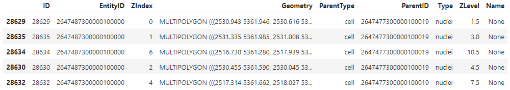
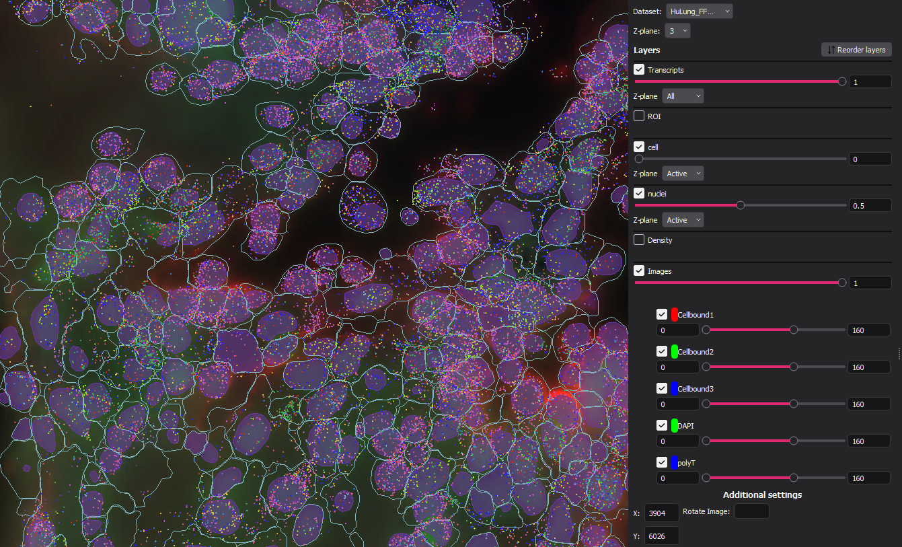

.. _Multiple Entities:

Multiple Entities
=========================================================

Overview
---------------------------

In ``vpt``, an "entity" refers to a cellular or sub-cellular structure for which we can identify a boundary polygon, such as a 
cell or a nucleus. ``vpt`` is expanding its capabilities to handle multiple entity types during both segmentation and the 
creation of entity relationships. As an example, a user may construct their own segmentation task that outputs both cells and 
nuclei, and this experimental version of ``vpt`` is able to establish relationships between pairs of cell and nucleus outputs. 
The rules for connecting entities of different types (e.g. cells and nuclei) are called "constraints," and can be customized 
by the user in the Segmentation Algorithm JSON file (see :ref:`Segmentation Task Definition`). A more detailed example of 
entity relationship constraints can be found in the :ref:`Multiple Entities` section.

The multiple entities that exist in this experimental version of ``vpt`` can assume different relationships under certain 
user-defined constraints. Each entity can stand alone with no relationship to any other type of other, be the "parent" to 
another entity, or the "child" of another entity. Taking cells and nuclei as an example, a common approach might be to enforce 
that every nucleus (or child) must have a cell (parent) that encompasses it. Because we are establishing relationships that may 
not already exist in the raw segmentation output, each constraint has a resolution strategy in the event that it is violated. 
The relationship constraints and resolution strategies that currently exist are as follows.

Constraints
---------------------------

- ``maximum_child_count``: Each parent entity is checked for children. If the number of children is greater than the input value, a problem is detected for that parent entity.

    **Valid resolution strategies:**

        - ``remove_child``
        - ``remove_parent``

- ``minimum_child_count``: Each parent entity is checked for children. If the number of children is smaller than the input value, a problem is detected for that parent entity.

    **Valid resolution strategies:**

        - ``remove_parent``
        - ``create_child`` *(only applied in segment-on-tile step)*

- ``child_must_have_parent``: Each child entity is checked for a parent. If no parent is assigned, a problem is detected for that child entity.

    **Valid resolution strategies:**

        - ``create_parent`` *(only applied in segment-on-tile step)*
        - ``remove_child``

- ``parent_must_cover_child``: Each child entity is to see if the parent entity completely covers the child (shapely predicate operation). If the child is not covered, a problem is detected for the child entity.

    **Valid resolution strategies:**

        - ``shrink_child``
        - ``remove_child``

- ``child_intersect_one_parent``: Each child entity is to see if it intersects a parent entity other than the one that it is assigned to. If the child intersects a second parent entity, a problem is detected for the child entity.

    **Valid resolution strategies:**

        - ``shrink_child``
        - ``remove_child``

Resolution Strategies
---------------------------

- ``remove_parent``: Delete the parent entity from the DataFrame
- ``remove_child``: Remove one or more child entities from the DataFrame
- ``create_child``: Create a child entity that is a copy of the parent entity in the child DataFrame. Assign parent when adding entity.
- ``create_parent``: Create a parent entity that is a copy of the child entity in the parent DataFrame. Assign parent when adding entity.
- ``shrink_child``: Use the parent entity to crop the child entity so that it fits completely within the parent.

Definitions
---------------------------

.. list-table::
   :header-rows: 1

   * - Key 
     - Type 
     - Values  
     - Meaning  
   * - ``parent_type``
     - string
     - Any string 
     - 
   * - ``child_type``
     - string
     - Any string 
     - 
   * - ``child_coverage_threshold``
     - float
     - 0.5 - 1
     - | Fraction of child entity volume that must be covered by parent volume. Values less than 0.5 are  
       | not allowed because they may lead to ambiguous assignments.
   * - ``constraints``
     - list
     -
     - List of constraints to apply to entities
   * - ``contraints.constraint``
     - string
     - | ``maximum_child_count``
       | ``minimum_child_count`` 
       | ``child_must_have_parent``
       | ``parent_must_cover_child``
       | ``child_intersect_one_parent``
     - The name of a constraint function to use to detect problems in the parent and child DataFrames
   * - ``contraints.value``
     - Any
     - Any or null
     - The parameter passed to the constraint function to detect conflicts
   * - ``contraints.resolution``
     - string
     - | ``remove_child`` 
       | ``remove_parent`` 
       | ``create_parent``
       | ``create_child``
       | ``shrink_child``
     - The conflict resolution method to resolve the problem detected by the constraint

Example Usage and Outputs
---------------------------

The multiple entity types, relationships, constraints, resolution strategies and parameters all need to be specified and 
configured in the Segmentation Algorithm JSON file according to the valid operations and values previously mentioned. Specifically,
the ``entity_type_relationships`` object in the segmentation algorithm file needs to be defined. An example of how to 
complete this is shown here:

.. code-block:: javascript

    ...
    "entity_type_relationships": { 
        "parent_type": "cell", 
        "child_type": "nuclei", 
        "child_coverage_threshold": 0.5, 
        "constraints": [ 
            {"constraint": "maximum_child_count", 
            "value": 1, 
            "resolution": "remove_child" 
            }, 
            {"constraint": "minimum_child_count", 
            "value": 1, 
            "resolution": "create_child" 
            }, 
            {"constraint": "child_must_have_parent", 
            "value": null, 
            "resolution": "create_parent" 
            }, 
            {"constraint": "parent_must_cover_child", 
            "value": null, 
            "resolution": "shrink_child" 
            }, 
            { "constraint": "child_intersect_one_parent", 
            "value": null, 
            "resolution": "shrink_child" 
            }, 
            {"constraint": "maximum_child_count", 
            "value": 1, 
            "resolution": "remove_child" 
            } 
        ] 
    }

The output ``SegmentationResult`` object has a dataframe attribute that is a ``geopandas`` GeoDataFrame containing all of the 
multiple entity type relationships, which in turn gets saved as a Parquet file. A loaded example of this is provided here: 

.. note::
    Because the ParentID column of the ``SegmentationResult`` dataframe can contain integers and NoneTypes, to preserve the 
    Int64 data type if the IDs, the boundary Parquet file should be read using the ``read_parquet()`` funtion within
    the ``vpt_core.io.input_tools`` module. Using ``read_parquet()`` within ``geopandas`` will truncate the number of unique 
    IDs.

Once the user has created the micron-space parquet boundary file and entity by gene csv file for each entity type, they 
can run ``update-vzg`` to create a new vzg file with multiple entities embedded within. The user can now explore their data 
with multiple entity types in mind as seen here:

